# 🚀 AREP - Taller 7: Arquitectura Serverless con AWS Lambda y Microservicios


## 📋 Descripción del Proyecto

Este proyecto implementa una aplicación de **microblogging** similar a Twitter, que permite a los usuarios publicar mensajes de hasta 140 caracteres. La aplicación fue desarrollada siguiendo una arquitectura evolutiva, comenzando como un **monolito Spring Boot** y evolucionando hacia una **arquitectura de microservicios serverless** desplegada en AWS.

### 🎯 Objetivos del Proyecto

1. ✅ Diseñar y desarrollar un API REST con Spring Boot (monolito)
2. ✅ Implementar tres entidades principales: Usuario, Stream y Posts
3. ✅ Crear un frontend interactivo con JavaScript vanilla
4. ✅ Desplegar la aplicación frontend en Amazon S3
5. ✅ Implementar seguridad con JWT usando Amazon Cognito
6. ✅ Separar el monolito en tres microservicios independientes
7. ✅ Desplegar los microservicios en AWS Lambda
8. ✅ Integrar con Amazon API Gateway para exponer los servicios

---

## 🏗️ Evolución de la Arquitectura

### Fase 1: Monolito (Desarrollo Local)

En la primera fase, se desarrolló una **aplicación monolítica** con Spring Boot que contenía toda la lógica de negocio en un solo proyecto. Esta implementación permitió:

- Desarrollo rápido y pruebas locales
- Gestión de usuarios, posts y streams en una sola aplicación
- Conexión a MongoDB Atlas como base de datos
- Ejecución local en `http://localhost:8080`

**Ventajas del Monolito:**
- Simple de desarrollar y probar
- Fácil de depurar
- No requiere configuración compleja de red

**Limitaciones:**
- Escalabilidad limitada
- Acoplamiento entre componentes
- Despliegue de todo o nada

### Fase 2: Microservicios Serverless (AWS Lambda)

En la segunda fase, el monolito fue **refactorizado en tres microservicios independientes**:

1. **👤 Users Service**: Gestión de usuarios y autenticación
2. **📝 Posts Service**: Creación y gestión de publicaciones
3. **📊 Streams Service**: Gestión del flujo de posts

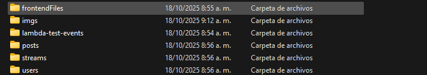

**Beneficios de los Microservicios:**
- ✅ Escalabilidad independiente de cada servicio
- ✅ Despliegue independiente
- ✅ Aislamiento de fallos
- ✅ Tecnologías específicas por servicio
- ✅ Costo optimizado con serverless (pago por uso)

---

## 🏛️ Arquitectura del Sistema

### Diagrama de Arquitectura AWS

```
                                    ┌─────────────────────┐
                                    │                     │
                                    │    ☁️  AWS CLOUD   │
                                    │                     │
                                    └─────────────────────┘
                                              │
                    ┌─────────────────────────┼─────────────────────────┐
                    │                         │                         │
                    │                         │                         │
       ┌────────────▼────────────┐ ┌─────────▼──────────┐ ┌───────────▼──────────┐
       │                         │ │                    │ │                      │
       │   📦 AMAZON S3          │ │  🔐 AMAZON         │ │   🚪 AMAZON API      │
       │   Static Website        │ │     COGNITO        │ │      GATEWAY         │
       │   Hosting               │ │   User Pool        │ │   REST API           │
       │                         │ │   JWT Auth         │ │   Authorization      │
       │   • HTML                │ │                    │ │                      │
       │   • CSS                 │ │   • idToken        │ │   • /users           │
       │   • JavaScript          │ │   • accessToken    │ │   • /posts           │
       │                         │ │   • refreshToken   │ │   • /streams         │
       │                         │ │                    │ │                      │
       └────────────┬────────────┘ └─────────┬──────────┘ └───────────┬──────────┘
                    │                        │                        │
                    │                        │                        │
                    │                        │                        │
       ┌────────────▼────────────────────────▼────────────────────────▼──────────┐
       │                                                                          │
       │                        🌐  INTERNET                                      │
       │                                                                          │
       └────────────┬─────────────────────────────────────────────────────────────┘
                    │
                    │
       ┌────────────▼────────────┐
       │                         │
       │   👤 USUARIO            │
       │   Navegador Web         │
       │                         │
       └─────────────────────────┘


                    ┌─────────────────────────────────────────────┐
                    │                                             │
                    │      ⚡ SERVERLESS FUNCTIONS (Lambda)       │
                    │                                             │
                    └──────┬──────────────┬──────────────┬────────┘
                           │              │              │
                           │              │              │
              ┌────────────▼───────┐ ┌───▼──────────┐ ┌─▼──────────────┐
              │                    │ │              │ │                │
              │  λ Lambda Function │ │  λ Lambda    │ │  λ Lambda      │
              │  USERS SERVICE     │ │  POSTS       │ │  STREAMS       │
              │  Port: 8080        │ │  SERVICE     │ │  SERVICE       │
              │                    │ │  Port: 8081  │ │  Port: 8082    │
              │  • GET /users      │ │              │ │                │
              │  • POST /users     │ │  • GET /posts│ │  • GET /streams│
              │  • PUT /users/:id  │ │  • POST      │ │  • POST        │
              │  • DELETE /:id     │ │  • DELETE    │ │  • PUT         │
              │  • POST /login     │ │              │ │                │
              │                    │ │              │ │                │
              └────────────┬───────┘ └───┬──────────┘ └─┬──────────────┘
                           │             │              │
                           │             │              │
                           └─────────────┼──────────────┘
                                         │
                                         │
                            ┌────────────▼────────────┐
                            │                         │
                            │   🍃 MongoDB Atlas      │
                            │   Cloud Database        │
                            │                         │
                            │   Collections:          │
                            │   • users               │
                            │   • posts               │
                            │   • streams             │
                            │                         │
                            └─────────────────────────┘
```

### Flujo de Datos

La arquitectura del sistema sigue un flujo completo desde el usuario hasta los servicios backend:

1. **Usuario** → Accede a la aplicación web a través de Internet
2. **Amazon S3** → Sirve los archivos estáticos del frontend (HTML, CSS, JS)
3. **Amazon Cognito** → Maneja la autenticación y proporciona tokens JWT
4. **Amazon API Gateway** → Punto de entrada único para todas las peticiones API, valida tokens
5. **AWS Lambda Functions** → Tres microservicios serverless independientes:
   - **GET /users** - Servicio de usuarios
   - **GET /posts** - Servicio de publicaciones  
   - **GET /streams** - Servicio de flujos
6. **MongoDB Atlas** → Base de datos NoSQL en la nube para persistencia

---

## 🎥 Video de Demostración

[](https://www.youtube.com/watch?v=C55S0Bi9lj8)

**[🎬 Ver Video Completo en YouTube](https://www.youtube.com/watch?v=C55S0Bi9lj8)**

En este video se muestra:
- ✅ Funcionamiento completo de la aplicación
- ✅ Proceso de autenticación con Cognito
- ✅ Creación y visualización de posts
- ✅ Integración de los microservicios
- ✅ Despliegue en AWS

---

## 📸 Capturas de Pantalla

### 🌐 Frontend Desplegado en Amazon S3

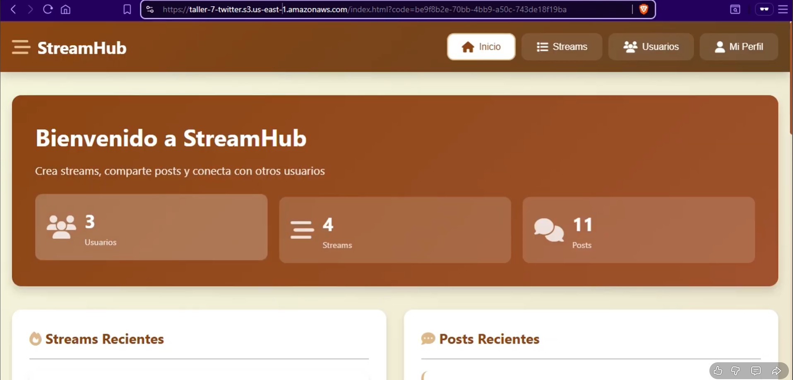
*Interfaz principal de la aplicación desplegada en S3*


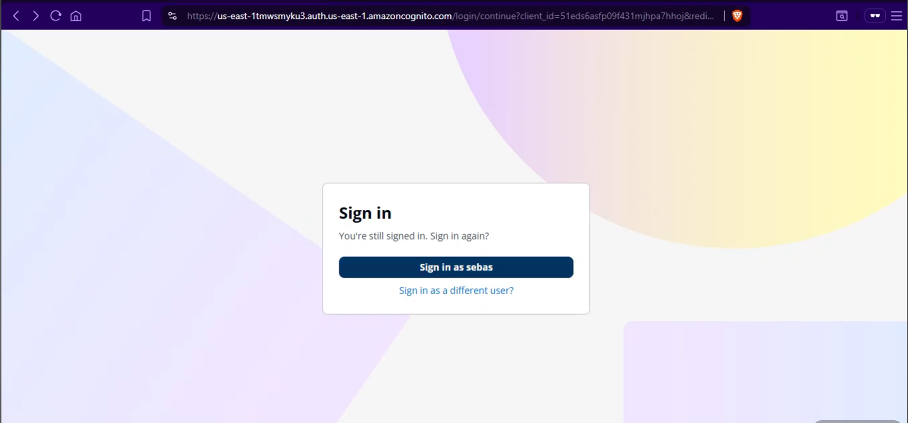
*Sistema de autenticación integrado con Amazon Cognito*

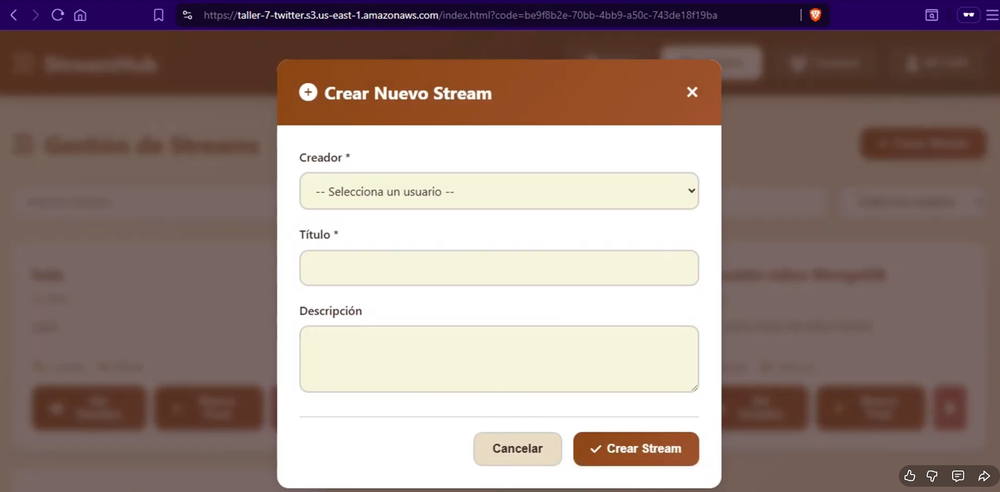
*Creación de streams*

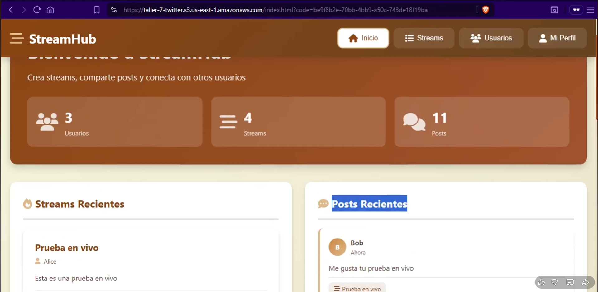
*Visualización de Streams y posts recientes*

### 🗄️ Base de Datos MongoDB Atlas

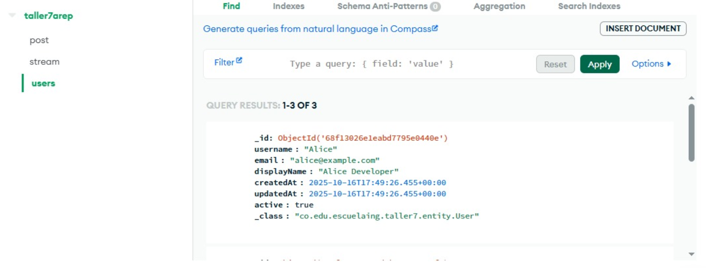
*Colección de usuarios en MongoDB Atlas*


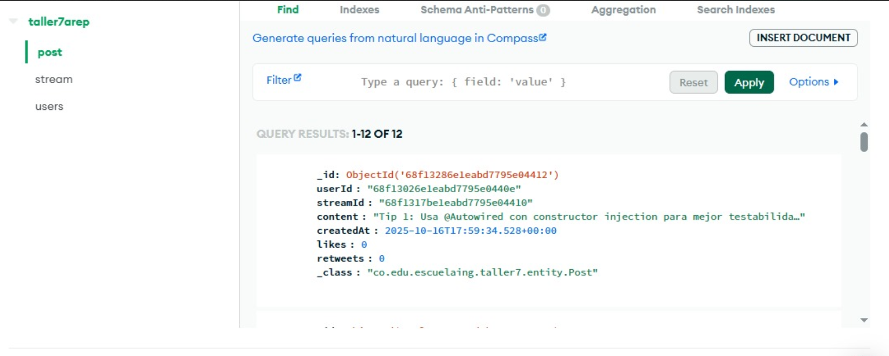
*Colección de posts almacenados en la base de datos*

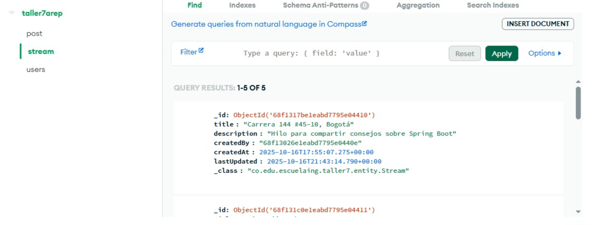
*Colección de streams que agrupan los posts*

### ⚡ Funciones Lambda en AWS

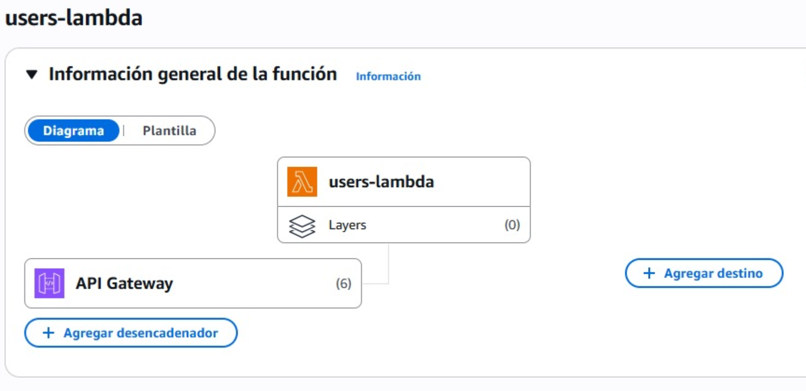
*Configuración del microservicio de usuarios en Lambda*

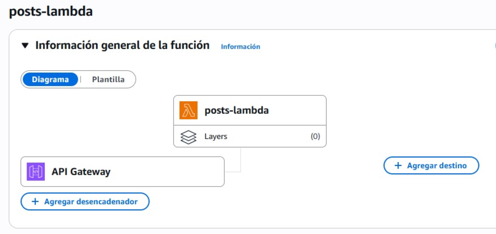
*Configuración del microservicio de posts en Lambda*

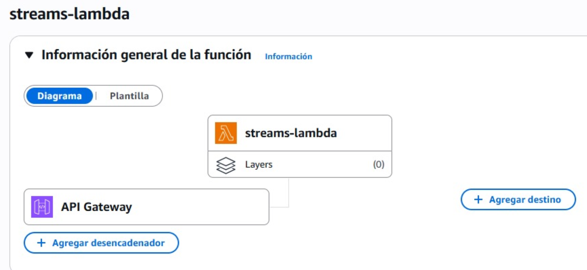
*Configuración del microservicio de streams en Lambda*


---

## 🛠️ Tecnologías Utilizadas

### Backend
- **Java 21**: Lenguaje de programación principal
- **Spring Boot 3.5.6**: Framework para desarrollo de aplicaciones
- **Spring Data MongoDB**: Integración con MongoDB
- **Spring Security**: Seguridad y autenticación
- **AWS Lambda**: Función serverless para los microservicios
- **Maven**: Gestión de dependencias

### Frontend
- **HTML5**: Estructura de la página
- **CSS3**: Estilos y diseño responsive
- **JavaScript**: Lógica del cliente
- **Fetch API**: Consumo de servicios REST

### Cloud & DevOps
- **Amazon S3**: Hosting del frontend estático
- **Amazon Cognito**: Autenticación y gestión de usuarios
- **Amazon API Gateway**: Exposición de APIs REST
- **AWS Lambda**: Ejecución serverless de microservicios
- **MongoDB Atlas**: Base de datos NoSQL en la nube

### Seguridad
- **JWT (JSON Web Tokens)**: Autenticación stateless
- **Amazon Cognito User Pool**: Gestión de identidades

---

## 📦 Estructura del Proyecto

```
AREP-TALLER7/
│
├── frontendFiles/              # Frontend de la aplicación
│   ├── index.html              # Página principal
│   ├── login-helper.html       # Página de ayuda para login
│   ├── app.js                  # Lógica del frontend
│   ├── styles.css              # Estilos CSS
│   └── JWT_SETUP.md            # Documentación JWT
│
├── users/                      # Microservicio de Usuarios
│   ├── src/
│   │   └── main/java/co/edu/escuelaing/users/
│   │       ├── controller/     # Controladores REST
│   │       ├── service/        # Lógica de negocio
│   │       ├── repository/     # Acceso a datos
│   │       ├── entity/         # Entidades del dominio
│   │       ├── security/       # Configuración de seguridad
│   │       └── lambda/         # Handler para AWS Lambda
│   └── pom.xml
│
├── posts/                      # Microservicio de Posts
│   ├── src/
│   │   └── main/java/co/edu/escuelaing/posts/
│   │       ├── controller/     # Controladores REST
│   │       ├── service/        # Lógica de negocio
│   │       ├── repository/     # Acceso a datos
│   │       ├── entity/         # Entidades del dominio
│   │       ├── security/       # Configuración de seguridad
│   │       └── LambdaHandler.java
│   └── pom.xml
│
├── streams/                    # Microservicio de Streams
│   ├── src/
│   │   └── main/java/co/edu/escuelaing/streams/
│   │       ├── controller/     # Controladores REST
│   │       ├── service/        # Lógica de negocio
│   │       ├── repository/     # Acceso a datos
│   │       ├── entity/         # Entidades del dominio
│   │       └── security/       # Configuración de seguridad
│   └── pom.xml
│
├── lambda-test-events/         # Eventos de prueba para Lambda
│   ├── create-user-event.json
│   ├── get-users-event.json
│   └── login-event.json
│
└── README.md                   # Este archivo
```

---

## 🚀 Guía de Instalación y Despliegue

### Prerrequisitos

- ☕ Java 21
- 📦 Maven 3.8+
- 🍃 Cuenta en MongoDB Atlas
- ☁️ Cuenta en AWS


### 1️⃣ Configuración Local del Monolito

#### Paso 1: Clonar el repositorio

```bash
git clone https://github.com/SebastianCardona-P/AREP-TALLER7.git
cd AREP-TALLER7
```

#### Paso 2: Configurar MongoDB Atlas

1. Crea una cuenta en [MongoDB Atlas](https://www.mongodb.com/cloud/atlas)
2. Crea un cluster gratuito
3. Obtén la cadena de conexión
4. Actualiza `application.yml` en cada microservicio:

```yaml
spring:
  data:
    mongodb:
      uri: mongodb+srv://<usuario>:<password>@cluster.mongodb.net/<database>
```

#### Paso 3: Ejecutar el Monolito Localmente

```bash
# Ir al directorio del servicio (ejemplo: users)
cd users

# Compilar el proyecto
mvn clean install

# Ejecutar la aplicación
mvn spring-boot:run
```

La aplicación estará disponible en `http://localhost:8080`

#### Paso 4: Probar el Frontend Localmente

Abre el archivo `frontendFiles/index.html` en un navegador o usa un servidor local:

```bash
# Usando Python
cd frontendFiles
python -m http.server 8000

# Accede a http://localhost:8000
```

### 2️⃣ Configuración de AWS Cognito

#### Paso 1: Crear un User Pool

1. Ve a AWS Cognito en la consola
2. Crea un nuevo User Pool
3. Configura los atributos de usuario (username, email)
4. Crea un App Client
5. Guarda el **User Pool ID** y **App Client ID**

#### Paso 2: Actualizar la Configuración

Actualiza los archivos de configuración con tus credenciales de Cognito:

```yaml
# application.yml
aws:
  cognito:
    userPoolId: us-east-1_XXXXXXXXX
    clientId: XXXXXXXXXXXXXXXXXXXXXXXXXX
    region: us-east-1
```

### 3️⃣ Despliegue en AWS Lambda

#### Paso 1: Empaquetar los Microservicios

```bash
# Para cada microservicio (users, posts, streams)
cd users
mvn clean package
```

Esto generará un archivo JAR en `target/users-0.0.1-SNAPSHOT.jar`

#### Paso 2: Crear las Funciones Lambda

Para cada microservicio:

1. Ve a AWS Lambda en la consola
2. Crea una nueva función
3. Selecciona "Java 21" como runtime
4. Sube el archivo JAR
5. Configura el handler:
   - **Users**: `co.edu.escuelaing.users.lambda.LambdaHandler::handleRequest`
   - **Posts**: `co.edu.escuelaing.posts.LambdaHandler::handleRequest`
   - **Streams**: `co.edu.escuelaing.streams.LambdaHandler::handleRequest`
6. Configura las variables de entorno (MongoDB URI, etc.)
7. Aumenta la memoria a al menos 512 MB
8. Aumenta el timeout a 30 segundos

#### Paso 3: Configurar API Gateway

1. Crea una nueva REST API
2. Crea recursos y métodos para cada microservicio:
   - `/users` → Lambda Users
   - `/posts` → Lambda Posts
   - `/streams` → Lambda Streams
3. Configura CORS
4. Habilita la autorización con Cognito
5. Despliega la API

### 4️⃣ Despliegue del Frontend en S3

#### Paso 1: Crear un Bucket S3

```bash
aws s3 mb s3://arep-taller7-frontend --region us-east-1
```

#### Paso 2: Configurar el Bucket para Hosting Estático

```bash
aws s3 website s3://arep-taller7-frontend --index-document index.html
```

#### Paso 3: Actualizar el Frontend

Edita `app.js` con la URL de tu API Gateway:

```javascript
const API_BASE_URL = 'https://YOUR_API_ID.execute-api.us-east-1.amazonaws.com/prod';
```

#### Paso 4: Subir los Archivos

```bash
cd frontendFiles
aws s3 sync . s3://arep-taller7-frontend --acl public-read
```

#### Paso 5: Acceder a la Aplicación

```
http://arep-taller7-frontend.s3-website-us-east-1.amazonaws.com
```

---

## 🔐 Seguridad con JWT

### Flujo de Autenticación

1. **Login**: El usuario envía credenciales a Cognito
2. **Token**: Cognito devuelve tres tokens:
   - `idToken`: Información del usuario
   - `accessToken`: Acceso a recursos
   - `refreshToken`: Renovación de tokens
3. **Almacenamiento**: Los tokens se guardan en `localStorage`
4. **Autorización**: Cada petición incluye el token en el header:
   ```
   Authorization: Bearer <idToken>
   ```
5. **Validación**: API Gateway valida el token con Cognito
6. **Acceso**: Si el token es válido, la petición llega al microservicio

### Ejemplo de Uso

Consulta el archivo [`frontendFiles/JWT_SETUP.md`](frontendFiles/JWT_SETUP.md) para instrucciones detalladas.

---

## 📡 API Endpoints

### Users Service

| Método | Endpoint | Descripción |
|--------|----------|-------------|
| POST | `/api/users` | Crear un nuevo usuario |
| GET | `/api/users` | Obtener todos los usuarios |
| GET | `/api/users/{id}` | Obtener usuario por ID |
| PUT | `/api/users/{id}` | Actualizar usuario |
| DELETE | `/api/users/{id}` | Eliminar usuario |
| POST | `/api/auth/login` | Autenticar usuario |

### Posts Service

| Método | Endpoint | Descripción |
|--------|----------|-------------|
| POST | `/api/posts` | Crear un nuevo post |
| GET | `/api/posts` | Obtener todos los posts |
| GET | `/api/posts/{id}` | Obtener post por ID |
| GET | `/api/posts/user/{userId}` | Posts de un usuario |
| DELETE | `/api/posts/{id}` | Eliminar post |

### Streams Service

| Método | Endpoint | Descripción |
|--------|----------|-------------|
| POST | `/api/streams` | Crear un nuevo stream |
| GET | `/api/streams` | Obtener todos los streams |
| GET | `/api/streams/{id}` | Obtener stream por ID |
| GET | `/api/streams/latest` | Stream más reciente |
| PUT | `/api/streams/{id}/posts` | Agregar post al stream |


### Pruebas con Postman

Importa los eventos de prueba desde `lambda-test-events/` para probar las funciones Lambda.


---

## 📊 Modelo de Datos

### Usuario (User)

```json
{
  "_id": "ObjectId",
  "username": "string",
  "email": "string",
  "password": "string (hashed)",
  "createdAt": "DateTime",
  "updatedAt": "DateTime"
}
```

### Post

```json
{
  "_id": "ObjectId",
  "userId": "ObjectId",
  "content": "string (max 140 chars)",
  "createdAt": "DateTime",
  "likes": "number",
  "retweets": "number"
}
```

### Stream

```json
{
  "_id": "ObjectId",
  "name": "string",
  "description": "string",
  "posts": ["PostId", "PostId", ...],
  "createdAt": "DateTime",
  "updatedAt": "DateTime"
}
```

---

## 🎯 Características Principales

- ✅ **Microblogging**: Posts de hasta 140 caracteres
- ✅ **Autenticación**: JWT con Amazon Cognito
- ✅ **Arquitectura Serverless**: AWS Lambda para escalabilidad
- ✅ **API RESTful**: Endpoints bien definidos
- ✅ **Frontend Responsive**: Diseño adaptable
- ✅ **Base de Datos Cloud**: MongoDB Atlas
- ✅ **Seguridad**: HTTPS, CORS, Tokens JWT
- ✅ **Microservicios**: Servicios independientes y desacoplados

---

## 🐛 Solución de Problemas

### Error: "CORS policy blocking"

- Verifica que API Gateway tiene CORS habilitado
- Asegúrate de que los headers estén configurados correctamente

### Error: "Unauthorized"

- Verifica que el token JWT sea válido
- Comprueba que el token no haya expirado
- Revisa la configuración de Cognito en API Gateway

### Error: "Lambda timeout"

- Aumenta el timeout en la configuración de Lambda
- Optimiza las consultas a la base de datos
- Aumenta la memoria asignada a la función

### Frontend no carga

- Verifica que el bucket S3 tenga hosting estático habilitado
- Comprueba los permisos del bucket (público)
- Revisa la configuración de CORS


## 👨‍💻 Autor

**Sebastian Cardona**
**Miguel Motta**
**Zayra Gutierrez**
- Proyecto: AREP - Taller 7
- Universidad: Escuela Colombiana de Ingeniería Julio Gaviria
